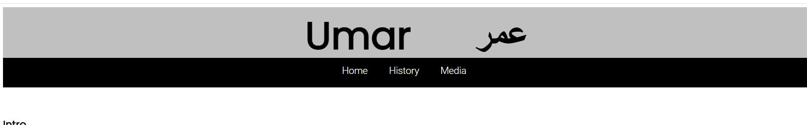
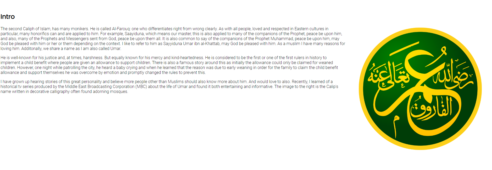
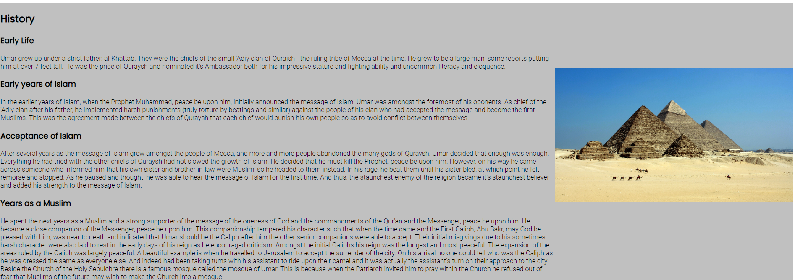

# Caliph Umar 

This website is dedicated to the Second Caliph of Islam - Umar. It is a basic introduction with links and references to other sources. Users will be able to read about this historical figure and watch a trailer for a historical tv series regarding him.

The page is split into 3 sections: an intro, a brief history and media representations.

## Features

* The top of the page shows the name of this historical figure in both English and Arabic.
* This is followed by a Navigation banner, which includes a link to the top of the page, the hisotry section and the media section
* The colour scheme is a very simple black and white including grey/silver to diferentiate sections clearly

### The Home/Intro Section

* The intro section gives a brief introduction about the reason for the page and my personal interest in the topic and istorical figure.
* It includes an image for interest

### The History section

* This section gives a brief history based on my memory of many sources including the MBC Omar Series mentioned in the article
* It includes an image of the pyramids of Giza. Egypt was one of the areas ruled by Caliph Umar

## The Media Section

* There is abrief sentence explaining that there is not a lot of media portraying the Caliph
* This section includes an iframe to play the trailer for the MBC Omar Series
* There is also a map showing the extent of the rule of the Caliph

seal from wiki: https://commons.wikimedia.org/wiki/File:Rashidun_Caliphs_Umar_ibn_Al-Khatt%C4%81b_-_%D8%B9%D9%8F%D9%85%D8%B1_%D8%A8%D9%86_%D8%A7%D9%84%D8%AE%D8%B7%D9%91%D8%A7%D8%A8_%D8%AB%D8%A7%D9%86%D9%8A_%D8%A7%D9%84%D8%AE%D9%84%D9%81%D8%A7%D8%A1_%D8%A7%D9%84%D8%B1%D8%A7%D8%B4%D8%AF%D9%8A%D9%86.svg

map from wikipedia: https://commons.wikimedia.org/wiki/File:Mohammad_adil_rais-Caliph_Umar%27s_empire_at_its_peak_644.PNG

code for youtube omar mbc trailer<iframe width="853" height="480" src="https://www.youtube.com/embed/l-vFh_q03kw" title="Omar Series Official Trailer" frameborder="0" allow="accelerometer; autoplay; clipboard-write; encrypted-media; gyroscope; picture-in-picture" allowfullscreen></iframe>

dome of the rock pic: Photo by Mauricio Artieda: https://www.pexels.com/photo/dome-of-the-rock-jerusalem-610533/
jerusalem pic: Photo by Haley Black: https://www.pexels.com/photo/white-concrete-building-2087387/

egypt pics: Photo by Pixabay: https://www.pexels.com/photo/great-sphinx-of-giza-under-blue-starry-sky-262780/
pyramids: Photo by David McEachan: https://www.pexels.com/photo/gray-pyramid-on-dessert-under-blue-sky-71241/

html validator said remove frameboarder attribute from iframes as it's obsolete. Then second check no errors

css validator found missing comma 
 lighthouse results: 
